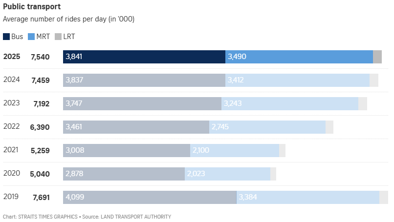

::: {.report-hero}
::: {.hero-kicker}
AAI1001 Team Project Proposal
:::

# Singapore Public Transport Ridership Recovery Across Bus, MRT & LRT

::: {.hero-author-label}
Author
:::

::: {.hero-author}
LAB-P1 Team 12
:::
:::

# Team Information

| Name | Student ID |
|---|---|
| Thaw Zin | XXXXXXX |
| Siyona | XXXXXXX |
| Wilson Teng Hao Feng | 2503002 |
| Troy | XXXXXXX |
| Zayar | XXXXXXX |

# 1. Introduction and Project Overview

## 1.1 Our Project's Aim

Singapore's public transport ridership has recovered strongly since the disruption caused by Covid-19, but the recovery is not evenly distributed across buses, MRT and LRT. The selected Straits Times visualization is useful because it shows average daily rides from 2019 to 2025 in a single chart, allowing the 2019 pre-pandemic baseline to be compared with the later recovery years.

Our project aims to use this original visualization as the starting point for a clearer data story about public transport recovery in Singapore. The key issue is not only whether total ridership has returned to its pre-pandemic level, but also how the recovery differs by transport mode. In the chart, MRT ridership in 2025 is above its 2019 level, bus ridership remains below its 2019 level, and LRT remains much smaller in scale while slipping slightly from 2024 to 2025.

The improved visualization will therefore focus on four connected dimensions: **year**, **transport mode**, **average daily ridership**, and **recovery relative to 2019**. This allows the project to move beyond a simple total-ridership comparison and examine how Singapore's public transport mode mix has changed over time.

::: {.question-grid}
::: {.question-card}
Q1
How did Singapore's average daily public transport ridership change from 2019 to 2025?
:::

::: {.question-card}
Q2
How did bus, MRT and LRT ridership recover differently relative to the 2019 baseline?
:::

::: {.question-card}
Q3
Has the overall public transport mode mix changed even though total ridership has nearly recovered?
:::
:::

## 1.2 Source & Context

::: {.source-card}
Original article
**["More rides on MRT in 2025 as LRT use fell; bus ride numbers still below pre-Covid-19 levels"](https://www.straitstimes.com/singapore/transport/more-people-used-mrt-in-2025-as-lrt-ridership-falls-bus-numbers-still-below-pre-covid-levels)**  
Published by *The Straits Times* on 30 January 2026. The article was written by Vanessa Paige Chelvan and reports Land Transport Authority (LTA) ridership figures.
:::

The chosen chart is a single quantitative news-media visualization about Singapore's public transport ridership. It shows the average number of daily rides, in thousands, for public bus, MRT and LRT services from 2019 to 2025. The underlying figures correspond to LTA's official **Average Public Transport Ridership By Year (2015 to 2025)** table, while the Straits Times article provides the news context and interpretation.

The key 2025 figures are consistent across the article, the chart and LTA's published data: MRT ridership reached **3.490 million daily trips**, bus ridership averaged **3.841 million daily trips**, and LRT ridership was **209,000 daily trips**. Compared with the 2019 baseline, MRT ridership increased from **3.384 million** to **3.490 million**, bus ridership remained below its 2019 level of **4.099 million**, and LRT was almost unchanged from **208,000** in 2019 after dipping slightly from **210,000** in 2024.

The topic is suitable for this project because it is quantitative, current and socially relevant. Public transport ridership reflects changes in commuting behaviour, remote work, rail network expansion, first- and last-mile travel, and post-pandemic mobility patterns. The original chart already communicates the broad recovery trend, but it creates opportunities for improvement because recovery relative to 2019 and mode-level changes are not equally easy to compare.

::: {.data-source-grid}
::: {.data-source-card}
Primary data direction
**LTA yearly public transport ridership**  
Average daily rides by year and transport mode, measured in thousands.
:::

::: {.data-source-card}
Optional enrichment
**Transport network context**  
Relevant rail-network or service-context information, if needed to explain mode shifts.
:::

::: {.data-source-card}
Analytical focus
**Recovery and mode mix**  
Mode share, year-on-year change and recovery index against 2019.
:::
:::

Together, these sources allow the project to move beyond a simple stacked total and examine recovery by mode, mode share and year-on-year change.

## 1.3 Our Chosen Visualization

{#fig-chosen-visualization fig-align="center" width="82%"}

### 1.3.1 Visualization Structure and Design

::: {.figure-shell}
::: {.figure-header}
Original chart structure
Horizontal stacked bars, one row per year, showing bus, MRT and LRT ridership.
:::

| Encoding | Meaning |
|---|---|
| Vertical row position | Year from 2019 to 2025 |
| Horizontal stacked bar length | Total average daily ridership for that year |
| Segment length | Average daily ridership for each transport mode, measured in thousands |
| Colour hue | Transport mode: Bus, MRT or LRT |
| Direct text labels | Total ridership beside each year; bus and MRT values inside the bar segments |
| Colour intensity | Latest year, 2025, is visually emphasized; earlier years are faded |

::: {.figure-note}
The original chart is useful as a compact overview, but some analytical comparisons, especially recovery relative to 2019 and the small LRT values, are not directly shown.
:::
:::

The original visualization is structured as a set of horizontal stacked bars, one row per year:

- Each row represents one year from 2019 to 2025.
- The bold number beside each year shows the total average daily ridership across bus, MRT and LRT, in thousands.
- Each stacked bar is divided into three coloured segments: dark blue for bus, blue for MRT and grey for LRT.
- The bus and MRT segments include direct value labels, while the LRT segment is only shown as a small grey segment at the end of each bar.
- The 2025 row uses stronger colour saturation than earlier years, directing attention to the most recent ridership figures.

The chart directly encodes **three dimensions** and **one aggregate measure**. It also supports a derived comparison against the 2019 baseline, but that recovery comparison is not explicitly encoded in the original design:

::: {.comparison-table}
| Dimension (Bolded) / Comparison | Type | How It Appears in the Original Chart |
|---|---|---|
| **Year** | Temporal / ordinal | One horizontal row for each year from 2019 to 2025 |
| **Transport mode** | Categorical | Colour-coded stacked segments for Bus, MRT and LRT |
| **Average daily ridership by mode** | Quantitative measure | Segment lengths, with direct labels for bus and MRT |
| Total average daily ridership | Aggregate quantitative measure | Bold total number beside each year and overall stacked bar length |
| Recovery relative to 2019 | Derived comparison, not directly encoded | Readers must compare later rows with the 2019 row manually |
:::

This structure makes the chart effective for showing the broad recovery pattern from 2019 to 2025. However, because the chart is a stacked bar chart, bus is the only mode with a consistent left baseline. MRT and LRT begin after earlier segments, making precise year-to-year mode comparison harder. The absence of direct LRT labels also means readers must subtract bus and MRT values from the total if they want exact LRT figures.

### 1.3.2 The Story It Tells

::: {.story-panel}
::: {.story-stat}
7.691M → 5.040M → 7.540M
Total daily public transport rides fell sharply in 2020, then recovered to about 98.0% of the 2019 level by 2025.
:::
:::

The original visualization shows a clear pattern about Singapore's public transport recovery after Covid-19. The overall recovery looks strong, but the mode-level details show that ridership did not return in exactly the same pattern as before the pandemic.

**Total ridership nearly recovered.** Total average daily public transport ridership fell from **7.691 million rides in 2019** to **5.040 million rides in 2020**, before rising to **7.540 million rides in 2025**. This means 2025 ridership was about **98.0% of the 2019 level**.

**MRT recovered more strongly than buses.** MRT ridership increased from **3.384 million daily rides in 2019** to **3.490 million in 2025**, exceeding its pre-pandemic level by about **106,000 daily rides**. Bus ridership remained below its 2019 level, decreasing from **4.099 million** to **3.841 million**, a gap of about **258,000 daily rides**.

**The balance between transport modes changed.** MRT's share of total ridership increased, while bus share decreased. Buses accounted for about **53.3%** of daily rides in 2019 but about **50.9%** in 2025, while MRT rose from about **44.0%** to **46.3%**. LRT stayed much smaller in scale, at **209,000 daily rides in 2025**, almost unchanged from **208,000 in 2019**.

Overall, the original chart gives a useful yearly overview of public transport recovery, but the current design makes the reader work too hard to extract the most important analytical comparisons. Our project will preserve the useful yearly overview while improving readability, highlighting recovery relative to 2019, and making changes in ridership share by transport mode easier to compare.

# 2. Critical Analysis of Original Visualization

::: {.section-lead}
This section reviews the original Straits Times chart by looking at both its useful features and its design limitations. The strengths show which parts of the chart should be retained, while the weaknesses highlight the areas that need improvement in the redesigned visualization.
:::

### 2.1 Strengths

What works well in the original chart

::: {.critique-grid}
::: {.critique-card .positive}
#### S1. Total ridership and mode split are shown together

The chart's strongest feature is that it shows both the total number of average daily rides and the split between bus, MRT and LRT in one compact view. This is useful because the project story depends on both the overall recovery and the changing contribution of each mode. It also helps readers see that similar total ridership levels can still have different ridership distributions across transport modes.
:::

::: {.critique-card .positive}
#### S2. The year-by-year layout makes the recovery trend easy to follow

The rows are arranged by year from 2025 at the top to 2019 at the bottom, allowing readers to scan the post-pandemic fall and recovery across time. The large drop in 2020 and the gradual return toward the 2019 level are visible without needing a separate time-series chart.
:::

::: {.critique-card .positive}
#### S3. Consistent colour mapping supports mode recognition

Bus, MRT and LRT use the same colours across all years. Even though the older rows are faded, the repeated colour mapping helps readers recognise the same transport modes throughout the chart.
:::

::: {.critique-card .positive}
#### S4. Key labels and source information are included

The title, subtitle, legend and source note give readers the basic context needed to interpret the chart. The subtitle states the unit, "Average number of rides per day (in '000)", and the source note credits the Land Transport Authority.
:::
:::

### 2.2 Weaknesses

What limits deeper interpretation

::: {.critique-grid}
::: {.critique-card .risk}
#### W1. The 2019 baseline is not visually marked

The article's story depends on whether ridership has returned to pre-Covid-19 levels, but the 2019 row is not marked as a baseline. Readers must manually compare 2020-2025 values against 2019 to judge recovery.
:::

::: {.critique-card .risk}
#### W2. Stacked bars make MRT and LRT comparisons less direct

In a stacked bar chart, only the first segment starts from a common baseline. Bus is easier to compare across years because it begins at the same left edge, while MRT and LRT begin after the preceding segments. This makes year-to-year comparison for MRT and LRT less precise.
:::

::: {.critique-card .risk}
#### W3. LRT is visually compressed and not directly labelled

LRT ridership is much smaller than bus and MRT ridership, so its grey segment appears as a thin end strip. The chart also does not label LRT values directly, making the 2024 to 2025 change from 210,000 to 209,000 rides almost impossible to detect visually.
:::

::: {.critique-card .risk}
#### W4. Recovery gaps and year-to-year changes are not calculated for the reader

The chart shows raw ridership values but does not show how far each mode is from its 2019 level or how values changed from year to year. Important comparisons, such as MRT being about 106,000 rides above 2019 while bus remains about 258,000 rides below 2019, have to be calculated separately by the reader.
:::

::: {.critique-card .risk}
#### W5. Changes in ridership share are hidden inside totals

The chart gives total ridership and mode values, but it does not directly show each mode's percentage share of total ridership. As a result, the shift from bus toward MRT is present in the data but not immediately visible.
:::

::: {.critique-card .risk}
#### W6. Faded older rows and low contrast reduce precise comparison

The stronger colour in the 2025 row successfully draws attention to the latest year, but the faded older rows make exact cross-year comparison harder. This also creates a readability and accessibility concern, especially for the small grey LRT segment, which is both small and low contrast.
:::
:::

::: {.recommendation-callout}
**Redesign direction.** The improved visualization should retain strengths S1 to S4 while addressing weaknesses W1 to W6 through a clearer 2019 baseline comparison, easier mode-level reading, direct LRT labelling, recovery-gap metrics and visible changes in ridership share by transport mode. This will help readers see what has recovered, what remains below the pre-pandemic level, and how the balance between transport modes has changed.
:::

# 3. Proposed Improvements

::: {.section-lead}
Based on the weaknesses identified in Section 2, our redesign will keep the final output as **one plot/chart**, not a dashboard or a collection of separate charts. The improved visualization will use one interactive chart to make the 2019 baseline, mode-level recovery gaps, LRT values and changes in ridership share by transport mode easier to compare.
:::

## 3.1 Redesign Concept

The proposed redesign is a single interactive recovery-index chart. The default view will show public transport ridership recovery indexed to **2019 = 100**, with one line for each transport mode: Bus, MRT and LRT. An optional indexed total ridership line may also be included or toggled on and off if it does not overcrowd the chart.

This design directly supports the project story because 2019 is the pre-Covid baseline. A value above 100 means ridership has exceeded its 2019 level, while a value below 100 means ridership is still below its 2019 level. This makes the recovery pattern easier to read than the original stacked bar chart, where readers must manually compare each later year against 2019.

Interactivity will support the main chart without turning it into a dashboard. Hover tooltips can show exact average daily rides, ridership share by transport mode, year-on-year change and recovery gap from 2019. If technically feasible, a simple metric control may allow the same chart to switch between **recovery index**, **absolute ridership** and **ridership share by transport mode**, while still remaining one chart object.

## 3.2 Improvement Plan

| Weakness Addressed | Proposed Improvement | Method / Technique |
|---|---|---|
| **W1, W4** | Make the 2019 baseline explicit. The original chart includes 2019, but it does not clearly mark it as the reference year for judging recovery. The redesigned chart will make 2019 the starting baseline for all modes. | Use a recovery index where **2019 = 100**; add a horizontal reference line at 100; use endpoint labels to show whether 2025 is above or below the baseline. |
| **W2** | Replace stacked segment comparison with common-baseline mode comparison. In the original stacked bar chart, bus is easier to compare than MRT and LRT because only bus starts from the same left edge. The improved chart will give each mode the same recovery-index baseline. | Use a line-and-point chart with year on the x-axis and recovery index on the y-axis; show bus, MRT and LRT as separate coloured lines. |
| **W3** | Make LRT readable despite its small absolute size. In the original chart, LRT appears as a thin grey segment because its ridership is much smaller than bus and MRT. The redesigned chart will allow LRT to be read as its own trend instead of being visually compressed. | Show LRT as its own line on the indexed scale; add hover tooltip values and selected endpoint labels for exact LRT ridership. |
| **W4** | Add computed recovery metrics instead of requiring manual calculation. The original chart shows raw ridership values, but it does not calculate how far each mode is from its 2019 level. | Derive recovery index, absolute gap from 2019 and percentage change from 2019; show these values in tooltips and selected annotations. |
| **W5** | Show changes in ridership share by transport mode. The original chart contains the data needed to see that MRT's share increased while bus share decreased, but this pattern is hidden inside the stacked totals. | Calculate each mode's percentage share of total ridership; show share values in tooltips; optionally allow a same-chart metric toggle to display ridership share. |
| **W6** | Improve readability and accessibility while preserving mode identity. The original chart uses strong colour for 2025 and faded colours for older years, which draws attention to the latest year but makes comparison harder. | Use consistent colour mapping for transport modes, stronger contrast, clearer labels and a colourblind-conscious palette. |

## 3.3 How the Single Chart Will Work

The improved chart will use the following encodings:

| Chart Element | Meaning |
|---|---|
| X-axis | Year, from 2019 to 2025 |
| Y-axis | Recovery index, where 2019 = 100 |
| Line colour | Transport mode: bus, MRT or LRT |
| Points | Yearly observations |
| Horizontal reference line | 2019 baseline at 100 |
| Endpoint labels | 2025 recovery status for each mode |
| Hover tooltip | Exact ridership, recovery index, gap from 2019, year-on-year change and ridership share |

The default recovery-index view will make the main comparison immediate. MRT should appear above the 100 baseline by 2025, showing that it exceeded its 2019 ridership level. Bus should remain below 100, showing that it has not fully returned to its 2019 level. LRT will be easier to inspect because it will no longer be compressed into a small end segment of a stacked bar.

## 3.4 Original Strengths Preserved

::: {.critique-card .positive}
**S1. Total ridership and mode-level context are retained.** The redesigned chart will still allow readers to understand both overall ridership recovery and differences between bus, MRT and LRT. Total ridership can be included as an optional line or displayed in the tooltip.

**S2. Year-by-year recovery remains easy to follow.** The improved chart keeps the same 2019 to 2025 time frame, so readers can still follow the drop in 2020 and the gradual recovery in later years.

**S3. Consistent colour mapping is preserved.** Each transport mode will continue to use a consistent colour across the chart. This helps readers track bus, MRT and LRT throughout the full period.

**S4. Labels and source information remain clear.** The improved visualization will keep a clear title, subtitle, legend, unit explanation and source note. It will also add more useful labels and hover details, such as the 2019 baseline, 2025 endpoint values and recovery gaps.
:::

## 3.5 Expected Outcome

The redesigned chart will answer the project question more directly: has Singapore's public transport ridership recovered relative to 2019, and did the recovery differ across bus, MRT and LRT?

Compared with the original stacked bar chart, the improved visualization will reduce manual calculation, make mode-level comparison clearer, and make the small LRT trend easier to read. It will also show that total public transport ridership almost recovered by 2025, but the recovery pattern changed because MRT rose above its 2019 level while bus ridership remained below it.

# 4. Data Sources & Data Quality

## 4.1 Selected Datasets

::: {.section-lead}
The improved visualization will use official Land Transport Authority ridership data as the numerical source. The Straits Times article and original chart are retained as the news-media source that defines the project story, but the final plotted values will come from LTA rather than being visually estimated from the image.
:::

Primary Dataset

| Field | Details |
|---|---|
| Dataset name | Average Public Transport Ridership By Year (2015 to 2025) |
| Publisher | Land Transport Authority (LTA), Singapore |
| Source | [LTA Statistics & Publications](https://www.lta.gov.sg/content/ltagov/en/who_we_are/statistics_and_publications/statistics.html), Public Transport Ridership section. Direct file: [Average Daily Public Transport Ridership by Year PDF](https://www.lta.gov.sg/content/dam/ltagov/who_we_are/statistics_and_publications/statistics/pdf/Public%20Transport%20Ridership%20-%20Average%20Daily%20Public%20Transport%20Ridership%20by%20Year.pdf) |
| Format | PDF table |
| Unit | Average number of rides per day, in thousands |
| Coverage used | 2019 to 2025, matching the original Straits Times chart |
| Variables needed | Year, Public Bus ridership, MRT ridership, LRT ridership |
| Role in project | Main dataset for the final chart. It will be used to calculate recovery index, 2019 gap, year-on-year change, total ridership and ridership share by transport mode. |

Supporting Dataset

| Field | Details |
|---|---|
| Dataset name | Average Public Transport Ridership By Month (2019 to 2025) |
| Publisher | Land Transport Authority (LTA), Singapore |
| Source | [LTA Statistics & Publications](https://www.lta.gov.sg/content/ltagov/en/who_we_are/statistics_and_publications/statistics.html), Public Transport Ridership section. Direct file: [Average Daily Public Transport Ridership by Month PDF](https://www.lta.gov.sg/content/dam/ltagov/who_we_are/statistics_and_publications/statistics/pdf/Public%20Transport%20Ridership%20-%20Average%20Daily%20Public%20Transport%20Ridership%20by%20Month.pdf) |
| Format | PDF table |
| Unit | Average number of rides per day, in thousands |
| Coverage used | 2019 to 2025 |
| Variables needed | Month, year, Public Bus ridership, MRT ridership, LRT ridership |
| Role in project | Supporting source for validation and context. It can be used to check whether the annual recovery pattern is consistent with monthly ridership trends, but the final proposed chart will use the official yearly dataset as the authoritative source. |

Original News-Media Source

| Field | Details |
|---|---|
| Article | ["More rides on MRT in 2025 as LRT use fell; bus ride numbers still below pre-Covid-19 levels"](https://www.straitstimes.com/singapore/transport/more-people-used-mrt-in-2025-as-lrt-ridership-falls-bus-numbers-still-below-pre-covid-levels) |
| Publisher | The Straits Times |
| Author and date | Vanessa Paige Chelvan, 30 January 2026 |
| Role in project | Defines the original news-media visualization, topic framing and critique target. It is not treated as the main numerical dataset because the underlying official ridership values are available from LTA. |

## 4.2 Justification for Dataset Selection

The yearly LTA ridership dataset is the most appropriate primary source because it directly matches the scope of the original visualization: yearly average daily ridership for public bus, MRT and LRT services. Using the official LTA table avoids estimating values from the Straits Times image and gives the project a reproducible numerical foundation.

The dataset also supports the proposed redesign in Section 3. From the raw yearly values, we can create the measures needed for the interactive recovery-index chart. These measures will be fully derived in the later data engineering workflow, but they are listed here to show why the yearly dataset is suitable for the redesign.

| Measure Needed                    | Purpose in the Improved Visualization                         |
| --------------------------------- | ------------------------------------------------------------- |
| Total ridership                   | Preserves the original chart's total-ridership context        |
| Recovery index                    | Makes the 2019 baseline explicit and comparable across modes  |
| Gap from 2019                     | Shows how far each mode is above or below the pre-Covid level |
| Year-on-year change               | Supports tooltip explanation of recovery momentum             |
| Ridership share by transport mode | Shows whether the balance between Bus, MRT and LRT changed    |

The monthly LTA dataset is useful as a supporting source, but it should not replace the annual table for the main chart. Monthly values can help check the annual recovery pattern and provide context if needed. However, since the proposed final visualization is annual, the official yearly table will remain the authoritative source for the plotted values.

Together, the selected sources satisfy the project requirements: the original visualization comes from an online news-media source, while the curated data for the improved visualization comes from an official public data source that supports cleaning, transformation and analysis.

## 4.3 Raw Data Structure and Known Challenges

The raw data is compact but not immediately analysis-ready because the LTA files are PDF tables rather than tidy CSV files. We will therefore document extraction, unit handling, mode labels and validation checks carefully before creating the visualization-ready dataset.

### 4.3.1 Public Transport Ridership Raw Layout

The primary yearly source is a PDF table titled **Average Public Transport Ridership By Year**. It contains one row per year and separate columns for public bus, MRT and LRT ridership. The useful raw structure is:

| Raw Column | Meaning | Planned Clean Column |
|---|---|---|
| Year | Calendar year | `year` |
| Public Bus | Average daily public bus rides, in thousands | `bus_rides_k` |
| MRT | Average daily MRT rides, in thousands | `mrt_rides_k` |
| LRT | Average daily LRT rides, in thousands | `lrt_rides_k` |

For the proposed visualization, the 2019-2025 subset will be used:

| Year | Public Bus ('000) | MRT ('000) | LRT ('000) | Total ('000) |
|---|---:|---:|---:|---:|
| 2019 | 4,099 | 3,384 | 208 | 7,691 |
| 2020 | 2,878 | 2,023 | 139 | 5,040 |
| 2021 | 3,008 | 2,100 | 151 | 5,259 |
| 2022 | 3,461 | 2,745 | 184 | 6,390 |
| 2023 | 3,747 | 3,243 | 202 | 7,192 |
| 2024 | 3,837 | 3,412 | 210 | 7,459 |
| 2025 | 3,841 | 3,490 | 209 | 7,540 |

### 4.3.2 Supporting Context Data Raw Layout

The monthly LTA source has a similar structure but is organised by month rather than by year. It will be treated as supporting context only unless we decide to add monthly validation in the final analysis.

| Raw Column | Meaning | Planned Clean Column |
|---|---|---|
| Month / Year | Monthly observation date | `month`, `year`, `date` |
| Public Bus | Average daily public bus rides for the month, in thousands | `bus_rides_k` |
| MRT | Average daily MRT rides for the month, in thousands | `mrt_rides_k` |
| LRT | Average daily LRT rides for the month, in thousands | `lrt_rides_k` |

The Straits Times article and local `ChosenVisualization.png` image will be used only as documentation of the original visualization. We will not digitise values from the image for the final dataset because the official LTA source provides the underlying data directly.

### 4.3.3 Identified Data Quality Challenges

| Issue | Severity | Planned Resolution |
|---|---|---|
| The primary source is a PDF table, not a machine-readable CSV file. Manual extraction could introduce transcription errors. | High | Extract the table carefully, then validate all 2019-2025 values against the original chart totals and the LTA PDF. Keep a raw copy and a cleaned table in the project folder for reproducibility. |
| Units are published in thousands of average daily rides. It is easy to mix up thousands, millions and raw ride counts. | High | Store ridership values in a clearly named `*_rides_k` format, and create formatted labels such as "3.490M" only at the visualization stage. |
| The LTA source labels bus ridership as "Public Bus", while the Straits Times chart labels it as "Bus". | Low | Standardise the mode label to `Bus` in the final chart, while documenting that it comes from LTA's `Public Bus` column. |
| Annual values are average daily ridership, not total annual passenger trips. | High | Do not interpret the figures as yearly totals. Titles, subtitles, tooltips and captions will state "average daily rides" clearly. |
| Monthly values should not be averaged naively to recreate annual values because months have different numbers of days. | Medium | Use the official annual dataset as the authoritative source for the final chart. If monthly data is used for validation, treat it as contextual rather than as a replacement for annual figures. |
| LRT values are small relative to bus and MRT, so rounding can make small differences look more precise than they are. | Medium | Label LRT values clearly, but interpret small changes such as 210,000 to 209,000 rides cautiously. Use the recovery-index view to make the trend readable without overstating the magnitude. |
| The latest available yearly dataset may be updated by LTA in future releases. | Low | Record the retrieval date and source links in the references. If the LTA file changes, rerun the cleaning pipeline and compare outputs before updating the final visualization. |

## 4.4 Data Quality Summary

Overall, the selected LTA datasets are suitable because they are official, directly related to the original Straits Times chart and use consistent transport-mode categories. The main data quality issues are not about missing data, but about correct interpretation and careful preparation. The most important issues are the unit of measurement, the use of 2019 as the baseline, the small scale of LRT ridership and the need to calculate recovery comparisons clearly.

These issues will be handled in the later data engineering workflow so that the final visualization can show recovery relative to 2019, differences between Bus, MRT and LRT, and changes in ridership share by transport mode.

# 5. Data Engineering Workflow

## 5.1 Planned Data Engineering Pipeline

::: {.placeholder-panel}
To be completed.
:::

Pipeline Principle

::: {.placeholder-panel}
Each stage should produce a named intermediate object so the workflow is reproducible, inspectable and easy to rerun.
:::

| Stage | Input | Main Operations | Output |
|---|---|---|---|
| 1. Ingest Raw Ridership Data |  |  |  |
| 2. Standardise Units, Years and Mode Labels |  |  |  |
| 3. Reshape to Long (Tidy) Format |  |  |  |
| 4. Derive Mode Shares, Recovery Index and Change Metrics |  |  |  |
| 5. Join, Validate and Export Visualization-Ready Objects |  |  |  |

## 5.2 Planned Cleaning and Transformation Decisions

::: {.placeholder-panel}
To be completed.
:::

| # | Issue | Decision | Rationale |
|---|---|---|---|
| D1 |  |  |  |
| D2 |  |  |  |
| D3 |  |  |  |
| D4 |  |  |  |
| D5 |  |  |  |

## 5.3 Target Output Schema

::: {.placeholder-panel}
To be completed.
:::

ridership_data · Primary Visualization Table

| Column | R Type | Source | Unit / Range | Role in Chart |
|---|---|---|---|---|
|  |  |  |  |  |
|  |  |  |  |  |

mode_labels · Annotation Table

| Column | R Type | Source | Unit / Range | Role in Chart |
|---|---|---|---|---|
|  |  |  |  |  |
|  |  |  |  |  |

## 5.4 Illustrative Code Structure

::: {.placeholder-panel}
To be completed.
:::

## 5.5 Reproducibility Considerations

::: {.placeholder-panel}
To be completed.
:::

# 6. Data Analysis Plan

## 6.1 What This Analysis Is For

::: {.placeholder-panel}
To be completed.
:::

## 6.2 Measures We Will Compute

::: {.placeholder-panel}
To be completed.
:::

| Measure | Formula / Method | Interpretation |
|---|---|---|
|  |  |  |
|  |  |  |

## 6.3 Planned Analyses

::: {.placeholder-panel}
To be completed.
:::

### A1 — Recovery Gap from 2019 by Mode

::: {.placeholder-panel}
To be completed.
:::

### A2 — Mode Share Shift Across Bus, MRT and LRT

::: {.placeholder-panel}
To be completed.
:::

### A3 — Year-on-Year Ridership Recovery Momentum

::: {.placeholder-panel}
To be completed.
:::

## 6.4 Summary: What We Produce (2025)

| ID | Question Answered (2025) | Output | Supports Which Insight | Data Needed |
|---|---|---|---|---|
| A1 |  |  |  |  |
| A2 |  |  |  |  |
| A3 |  |  |  |  |

# 7. Planned Work Distribution

::: {.placeholder-panel}
To be completed with final task ownership.
:::

| Team Member | Primary Tasks | Est. Hours |
|---|---|---|
| Thaw Zin |  |  |
| Siyona |  |  |
| Wilson |  |  |
| Troy |  |  |
| Zayar |  |  |
| All Members |  |  |

# 8. References

## 8.1 Article Source

::: {.placeholder-panel}
The Straits Times article URL and citation details will be finalized here.
:::

## 8.2 Data Sources

::: {.placeholder-panel}
LTA and supporting data source citations will be finalized here.
:::

## 8.3 Design Reference

::: {.placeholder-panel}
Design and accessibility references will be finalized here if used.
:::

# 9. Appendix: Data Dictionary

::: {.placeholder-panel}
To be completed after the target output schema is confirmed.
:::

## A.1 ridership_data — Primary Visualization Table

| Column | R Type | Source | Unit / Range | Role in Chart |
|---|---|---|---|---|
| year |  |  |  |  |
| mode |  |  |  |  |
| daily_rides_k |  |  |  |  |
| recovery_index |  |  |  |  |

## A.2 mode_labels — Annotation Table

| Column | R Type | Source | Unit / Range | Role in Chart |
|---|---|---|---|---|
| year |  |  |  |  |
| mode |  |  |  |  |
| label_value |  |  |  |  |
| label_position |  |  |  |  |
